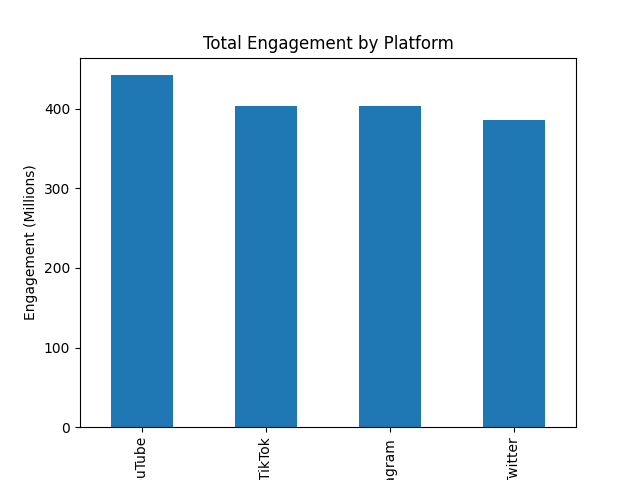
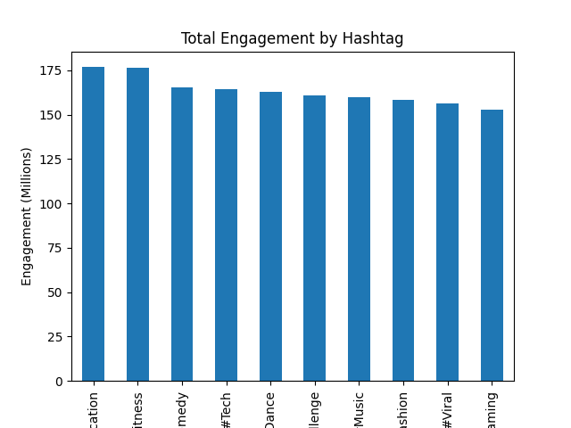
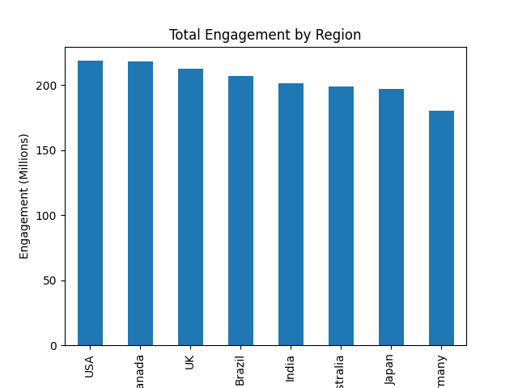

# Social Media Engagement Analysis

## Project Overview
This project analyzes social media engagement trends across multiple platforms using a dataset of viral social media posts. The goal of the analysis is to understand how engagement varies by platform, hashtag, and geographic region.

The dataset includes metrics such as views, likes, shares, and comments from several social media platforms.

---

## Dataset
Source: Kaggle – Viral Social Media Trends Dataset

The dataset includes the following fields:

- Platform
- Hashtag
- Content Type
- Region
- Views
- Likes
- Shares
- Comments

---

## Tools Used
- Python
- Pandas
- Matplotlib
- SQL
- Jupyter Notebook
- VS Code

---

## Data Preparation
An engagement metric was created to measure total interaction per post.

```
Engagement = Likes + Shares + Comments
```

This metric was used to analyze how audiences interact with content across different platforms and topics.

---

## Analysis

### Engagement by Platform
- **YouTube** generated the highest total engagement (~441.8 million).
- **TikTok (~403.8M)** and **Instagram (~402.9M)** showed very similar engagement levels.
- **Twitter (~386.0M)** had the lowest engagement among the four platforms.

### Engagement by Hashtag
- **#Education (~176.8M)** and **#Fitness (~176.3M)** produced the highest engagement.
- **#Comedy (~165.6M)** and **#Tech (~164.2M)** also performed strongly.
- **#Gaming (~153.0M)** had the lowest engagement in the dataset.

### Engagement by Region
- The **USA generated the highest engagement (~218.7M)**.
- **Canada (~218.2M)** and the **UK (~212.6M)** followed closely.
- **Germany (~180.2M)** showed the lowest engagement.

---

## Visualizations

Charts generated during the analysis are saved in the **outputs** folder.

### Engagement by Platform


### Engagement by Hashtag


### Engagement by Region


---

## SQL Example

Example SQL query used to calculate engagement by platform:

```sql
SELECT 
    Platform,
    SUM(Likes + Shares + Comments) AS Total_Engagement
FROM social_media_engagement
GROUP BY Platform
ORDER BY Total_Engagement DESC;
```

---

## Project Structure

```
social-media-engagement-analysis
│
├── data
│   └── Cleaned_Viral_Social_Media_Trends.csv
│
├── notebooks
│   └── social_media_analysis.ipynb
│
├── outputs
│   ├── engagement_by_platform.png
│   ├── engagement_by_hashtag.png
│   └── engagement_by_region.png
│
└── README.md
```

---

## Key Takeaways
- Video-focused platforms tend to generate the most engagement.
- Hashtags related to education and fitness show strong interaction levels.
- Engagement levels are fairly consistent globally, with slight regional differences.